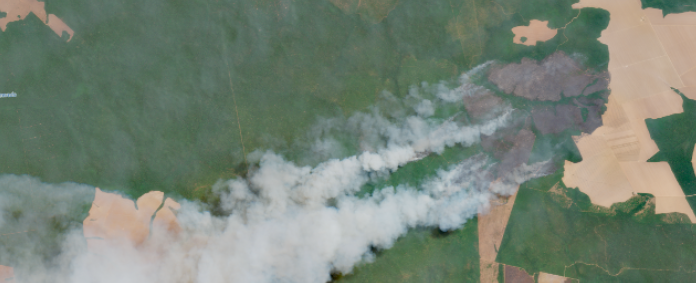

# osapiens Challenge Makeathon 2026

## Detecting Deforestation from Space



This repository contains the materials for the osapiens Makeathon 2026 challenge on deforestation detection from multimodal satellite data. The goal is to build a system that identifies deforestation events after 2020 using noisy, heterogeneous geospatial inputs and weak supervision signals.

## Start Here

If you are new to the repository, use these files in this order:

1. [osapiens-challenge-full-description.md](./osapiens-challenge-full-description.md) for the written challenge brief and context.
2. [challenge.ipynb](./challenge.ipynb) for the full walkthrough of the dataset structure, label encodings, visualizations, and submission example.
3. [download_data.py](./download_data.py) for the dataset download entrypoint used by the project.

## Repository Guide

- [challenge.ipynb](./challenge.ipynb): Main challenge notebook with data layout, modality descriptions, label definitions, examples, and submission guidance.
- [osapiens-challenge-full-description.md](./osapiens-challenge-full-description.md): Full challenge description.
- [download_data.py](./download_data.py): Downloads the challenge data from S3 into `./data`.
- [submission_utils.py](./submission_utils.py): Utility for converting prediction rasters into submission-ready GeoJSON.
- [Makefile](./Makefile): Convenience targets for environment setup and data download.

## Setup

Create the virtual environment and install the dependencies:

```bash
make install
```

Download the dataset:

```bash
make download_data_from_s3
```

This uses [download_data.py](./download_data.py) and stores the files under:

```text
data/makeathon-challenge/
```

## Dataset Layout

After downloading, the notebook expects the data in the following structure:

```text
data/makeathon-challenge/
├── sentinel-1/
│   ├── train/{tile_id}__s1_rtc/{tile_id}__s1_rtc_{year}_{month}_{ascending|descending}.tif
│   └── test/...
├── sentinel-2/
│   ├── train/{tile_id}__s2_l2a/{tile_id}__s2_l2a_{year}_{month}.tif
│   └── test/...
├── aef-embeddings/
│   ├── train/{tile_id}_{year}.tiff
│   └── test/...
├── labels/train/
│   ├── gladl/
│   ├── glads2/
│   └── radd/
└── metadata/
    ├── train_tiles.geojson
    └── test_tiles.geojson
```

## Explore the Notebook for the Full Challenge Walkthrough
